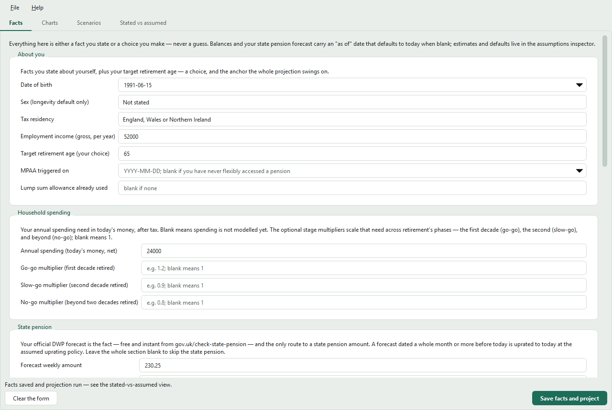
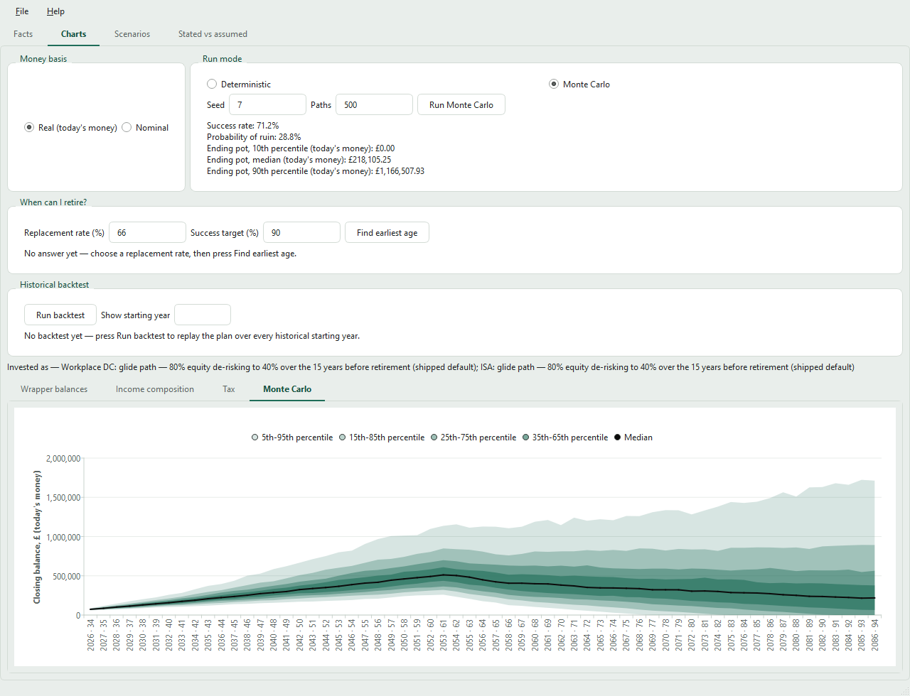
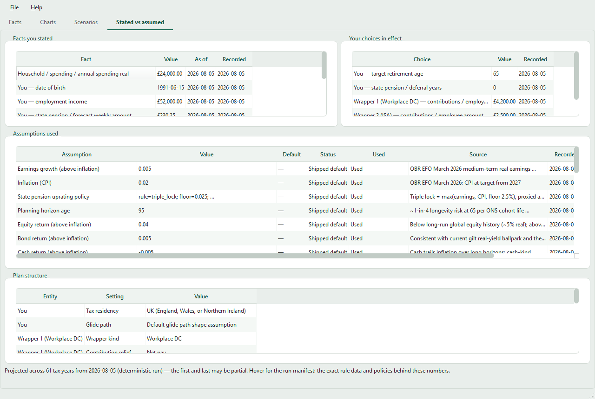

# Getting started with glidepath

A step-by-step guide to installing glidepath, entering your plan, reading
the projection, and changing the assumptions behind it. Every screen
mentioned here is also described inside the app under Help → "How to use
glidepath".

> Glidepath is a personal modelling tool for exploring retirement
> scenarios. It is not financial advice and is not regulated; its
> outputs depend on assumptions that will not match reality. Do not make
> financial decisions based solely on this tool.

## Step 1 — Install

Glidepath is installed with [uv](https://docs.astral.sh/uv/), which also
fetches the Python it needs — you do not need Python installed first.

1. **Install uv.** Open a terminal (Windows: PowerShell) and run one
   line.

   Windows:

   ```powershell
   powershell -ExecutionPolicy ByPass -c "irm https://astral.sh/uv/install.ps1 | iex"
   ```

   macOS or Linux:

   ```sh
   curl -LsSf https://astral.sh/uv/install.sh | sh
   ```

   Close and reopen the terminal, then check that `uv --version` prints
   a version.

2. **Install glidepath:**

   ```sh
   uv tool install glidepath
   ```

   This downloads glidepath and everything it needs (including the
   Python it runs on) — allow a few minutes and a few hundred megabytes
   the first time.

3. **Launch it:**

   ```sh
   glidepath
   ```

If the terminal cannot find `glidepath`, run `uv tool update-shell`
once and reopen the terminal. To move to a newer release later, run
`uv tool upgrade glidepath`.

## Step 2 — First launch

Read and accept the disclaimer. The app then opens with an **example
plan** already entered and projected, so every tab has something to
show; a note under the form's buttons reminds you that it is example
data, not yours. You can look around the tabs with it, then either
overwrite its values with your own or press **Clear the form** to start
blank.

Everything stays on your computer. Nothing is transmitted anywhere.

## Step 3 — Gather what you will enter

The projection is built from **facts** you state and **choices** you
make; the app never guesses either. Collecting these before you start
makes the Facts tab a five-minute job. Only the starred items are
required — leave anything else blank if it does not apply.

**About you**

- Date of birth \*
- Tax residency \* — England, Wales or Northern Ireland, or Scotland
  (they have different income-tax bands)
- Gross employment income per year (before tax; from your payslip or
  P60)
- Target retirement age \* — your choice; you can test others later

**Household spending**

- Annual spending in today's money, after tax — what you expect to
  need in retirement, not what you spend now with a mortgage and
  commute

**State pension**

- Your official forecast: the weekly amount from
  [gov.uk/check-state-pension](https://www.gov.uk/check-state-pension),
  and any "protected payment" it shows. The app uses DWP's figure as
  stated — it never re-derives it.

**Each savings account ("wrapper")** — one entry per account

- Kind: workplace pension, SIPP, stocks & shares ISA, Lifetime ISA,
  general investment account, or cash savings
- Balance \* from your latest statement, and the statement date (for
  pensions, the uncrystallised balance; a separate field takes any
  amount already in drawdown)
- Your own contribution per year (gross) and, for a workplace pension,
  your employer's — from your payslip or scheme terms
- For pensions, how tax relief is given: **net pay** (contribution
  taken before tax) or **relief at source** (the provider adds basic
  rate relief) — your scheme booklet or payslip says which
- Optionally, the equity percentage you hold it in; left blank, the
  account follows the app's de-risking glide path

**Defined benefit pension** — if you have one, from its latest
statement

- Accrued annual pension and the statement date, and the scheme's
  normal pension age
- If you are still building it up: the accrual rate (e.g. 1/60th) and
  your pensionable salary

**A partner** — the same set of facts for them, entered in the partner
sections; the app then models the household together.

## Step 4 — Enter it on the Facts tab

<p align="center">
  
</p>

1. Work down the form section by section: **About you**, **Household
   spending**, **Retirement income**, **State pension**, then one
   **Savings wrapper** card per account (press *Add wrapper* for each)
   and a **Defined benefit pension** card if you have one.
2. Fields marked `*` are required. Hover any field for its guidance;
   each section's **More options** reveals the rarely needed fields.
   Dates can be typed as `YYYY-MM-DD` or picked from the calendar.
3. **Retirement income** holds two choices you can change any time:
   drawdown only (the default — everything stays invested and is drawn
   as needed) or an annuity/mix, and which drawdown withdrawal strategy
   to model. The defaults are fine to start with.
4. Press **Save facts and project**. If anything cannot be read, the
   message under the buttons and a note under each affected field say
   what to fix, and nothing is saved until it parses.

The projection runs immediately and the other tabs fill in.

## Step 5 — Read the projection

<p align="center">
  
</p>

The **Charts** tab draws one bar per tax year, labelled with the year
and your age at its start: wrapper balances, where each year's income
comes from, and tax due. Hover any bar for the exact figures, switch
between **Chart** and **Table**, and use the basis toggle to view
today's money (real) or cash-of-the-day (nominal). A shortfall in any
year — a spending need the plan could not meet — is the sign that the
plan runs out.

The cards beside the charts answer the questions people actually ask:

- **Monte Carlo** — switch the run mode to Monte Carlo, choose the
  number of paths and a seed, and press **Run Monte Carlo**. You get
  the success rate, the probability of ruin, and a fan chart on its own
  tab showing the spread of outcomes; the same seed always reproduces
  the same result.
- **When can I retire?** — set the replacement rate (66% of your gross
  employment income by default) and press **Find earliest age**.
- **How much can I draw down?** — pick a retirement age and press
  **Find sustainable income** for the highest net income, in today's
  money, the plan sustains from that age.
- **Historical backtest** — press **Run backtest** to replay the plan
  over every starting year of market history since 1900 and see the
  share of starting years it survives, plus the best and worst.

Runs execute in the background, and any change to the plan clears a
held result so the screen never shows a run that no longer matches
your inputs.

## Step 6 — Adjust the assumptions (growth rate, inflation, fees…)

<p align="center">
  
</p>

Everything the projection needed that you did not state is an
**assumption** the app supplied — investment growth, inflation, fees,
how long to plan for. The **Stated vs assumed** tab lists every one
with its value, its source, the date it was recorded, and whether it is
the *Shipped default* or *Your override*.

To change one:

1. Open the **Stated vs assumed** tab and find the row in the
   assumptions table.
2. **Double-click it.** A prompt asks for the new value; the projection
   re-runs the moment you confirm, and the row's status changes to
   *Your override*.
3. To go back to the default, double-click again and leave the value
   **blank**.

Rates are entered as plain fractions per year — `0.04` means 4% — and
the return rates are **above inflation** (real), so the shipped 4%
equity return with 2% inflation is 6% in cash terms.

The assumptions most people want to look at first:

| Row on the tab | Shipped default | What it does |
| --- | --- | --- |
| Equity return (above inflation) | `0.04` (4%/yr) | **The growth rate** — real return on the equity part of every account |
| Bond return (above inflation) | `0.005` (0.5%/yr) | Real return on the bond part |
| Cash return (above inflation) | `-0.005` (−0.5%/yr) | Real return on cash |
| Inflation (CPI) | `0.02` (2%/yr) | Turns today's money into future cash; also how tax thresholds move once the current freeze ends |
| Earnings growth (above inflation) | `0.005` (0.5%/yr) | How your salary — and contributions set to grow with it — rise |
| Platform fee | `0.0025` (0.25%/yr) | Charged on every invested account |
| Fund fee | `0.0015` (0.15%/yr) | Fund charges (OCF) on every invested account |
| Planning horizon age | `95` | The age the projection runs to — the money has to last this long |
| Default glide path shape | 80% equity, de-risking over the 15 years before retirement to 40%, then held | The asset mix of any account where you left the equity % blank |
| Equity / bond / cash volatility | `0.18` / `0.07` / `0.01` | How much returns vary — Monte Carlo only |
| State pension uprating policy | triple lock | How the state pension grows each year |

The other rows (correlations, yields, annuity rates, survivor
fractions) are documented with their sources in the **Default
assumptions** section of `docs/planning.md`, and each row's *Source*
column on the tab says where its figure came from.

A few rows are small tables rather than single numbers (the glide
path shape, the uprating and tax policies). Double-clicking one opens
a multi-line prompt showing the current `key = value` lines; edit the
values you want and keep the rest. For example, a more aggressive
glide path:

```text
equity_start = 0.9
derisk_years_before_retirement = 10
equity_at_retirement = 0.5
transition = linear
in_drawdown = hold
```

Your overrides are saved with the plan and shown as *Your override*
everywhere the plan is reported — so a projection can always answer
"which of these numbers did I state, and which did the app assume?"

## Step 7 — Try what-ifs on the Scenarios tab

Overrides on the Stated vs assumed tab change *the* plan. To compare
alternatives side by side without touching it, use **Scenarios**:

1. Press **Add scenario…** and name it (say, "Retire at 60").
2. Press **Add override…**, pick what to change — one of your choices
   (retirement age, a contribution, the withdrawal strategy) or an
   assumption (such as the equity return) — and enter the value.
3. The comparison table and chart show every scenario against the
   **Base plan** on the metric and money basis you pick.

A scenario never changes a stated fact; only choices and assumptions
can be overridden, which is the point of separating them.

## Step 8 — Save and export

- **File → Save plan** writes everything — facts, choices, overrides,
  scenarios — to a `.glidepath.json` file wherever you choose
  (**Save plan as…** picks a new file); **Open plan…** loads one back,
  and the last plan you used reopens on the next launch.
- **File → Export cash flow (CSV)** writes the per-year table exactly as
  charted, for a spreadsheet.
- **File → Export report (PDF)** prints the whole plan: your inputs
  with their stated-vs-assumed provenance, the charts, Monte Carlo
  metrics when a run is held, and the scenario comparison. Both
  exports carry the disclaimer.
